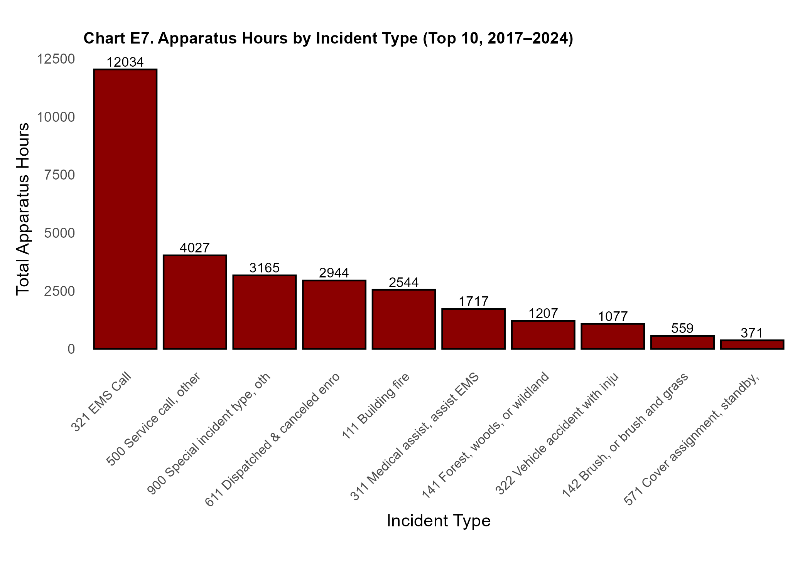
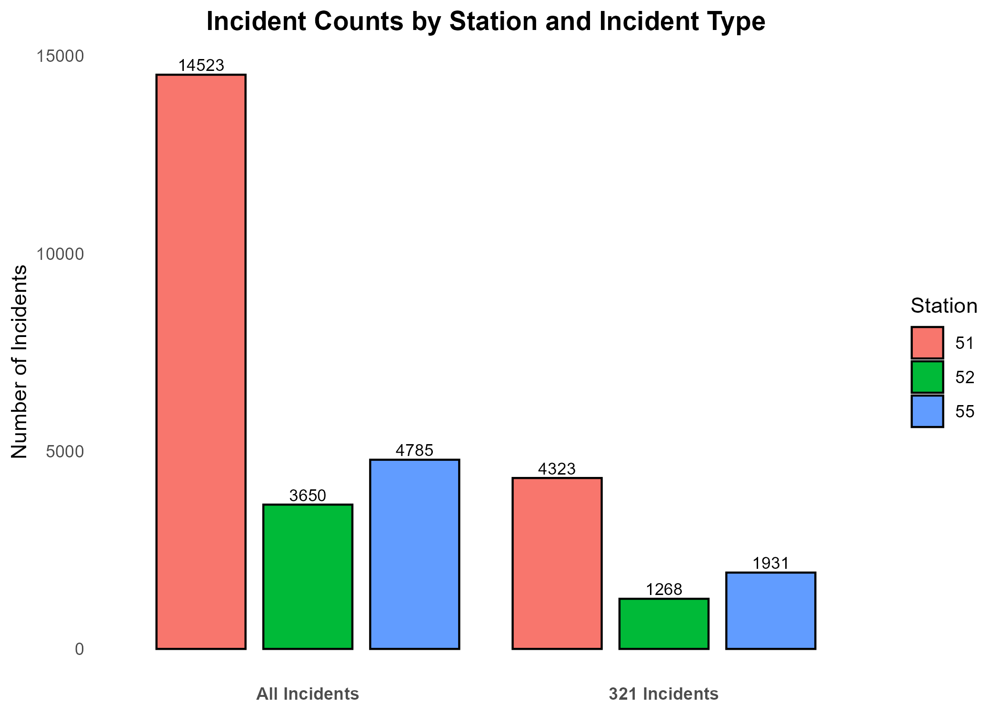

# El Cerrito Fire Department Analysis (2017–2024)

This project analyzes fire department activity in El Cerrito and Kensington using incident data, response times, and spatial patterns. The analysis includes over 20,000 fire incidents and highlights key trends by region, station, and type.

## Response Times by Region

This chart compares response times in three distinct areas:
- El Cerrito East
- El Cerrito West
- Kensington

## Incident Counts by Station

Stations 51, 52, and 55 represent the El Cerrito–Kensington coverage area. The chart shows total incident counts per station.

## Tools Used

- R for data cleaning, charting, and statistical analysis
- Microsoft Word for report formatting
- GitHub for publishing
- Google Maps to assist with geographic classification and proximity calculations

[Read the full report (Word)](https://github.com/IraSharenow100/el-cerrito-fire-report/raw/main/El-Cerrito-Fire-Department-Analysis-20250728.docx)

